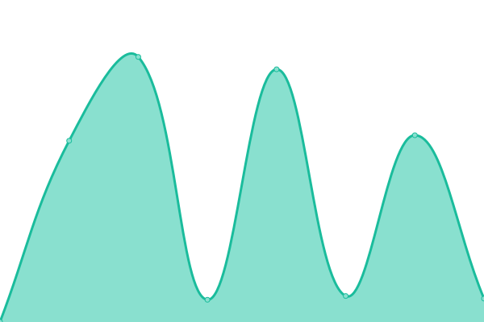
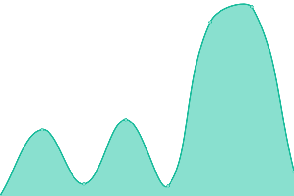
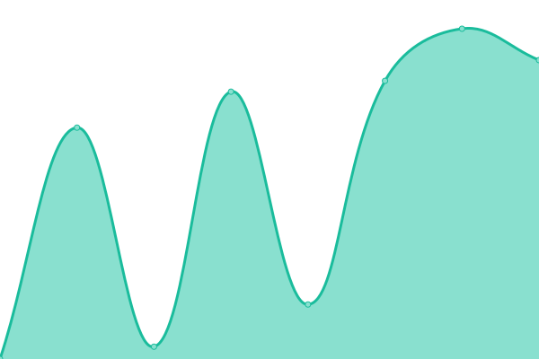

# [📈 Live Status](https://upptime.github.io/upptime): <!--live status--> **🟧 Partial outage**

This repository contains the open-source uptime monitor and status page for [Upptime](https://upptime.js.org), powered by [Upptime](https://github.com/upptime/upptime).

With [Upptime](https://upptime.js.org), you can get your own unlimited and free uptime monitor and status page, powered entirely by a GitHub repository. We use [Issues](https://github.com/upptime/upptime/issues) as incident reports, [Actions](https://github.com/fresherr/treeum-uptime/actions) as uptime monitors, and [Pages](https://upptime.github.io/upptime) for the status page.

<!--start: status pages-->
<!-- This summary is generated by Upptime (https://github.com/upptime/upptime) -->
<!-- Do not edit this manually, your changes will be overwritten -->
<!-- prettier-ignore -->
| URL | Status | History | Response Time | Uptime |
| --- | ------ | ------- | ------------- | ------ |
|  [finance.ua](https://finance.ua) | 🟩 Up | [finance-ua.yml](https://github.com/fresherr/treeum-uptime/commits/HEAD/history/finance-ua.yml) | 

 1047ms
     
 | 

<a href="https://fresherr.github.io/treeum-uptime/history/finance-ua">100.00%</a>
    

|  [finance/insurance](https://finance.ua/ua/insurance) | 🟩 Up | [finance-insurance.yml](https://github.com/fresherr/treeum-uptime/commits/HEAD/history/finance-insurance.yml) | 

 533ms
     
 | 

<a href="https://fresherr.github.io/treeum-uptime/history/finance-insurance">100.00%</a>
    

|  [finance/greencard](https://finance.ua/ua/insurance/greencard) | 🟩 Up | [finance-greencard.yml](https://github.com/fresherr/treeum-uptime/commits/HEAD/history/finance-greencard.yml) | 

 435ms
     
 | 

<a href="https://fresherr.github.io/treeum-uptime/history/finance-greencard">100.00%</a>
    

|  [finance/osago](https://finance.ua/ua/insurance/osago) | 🟩 Up | [finance-osago.yml](https://github.com/fresherr/treeum-uptime/commits/HEAD/history/finance-osago.yml) | 

 784ms
     
 | 

<a href="https://fresherr.github.io/treeum-uptime/history/finance-osago">100.00%</a>
    

|  [finance/travel](https://finance.ua/ua/insurance/travel) | 🟩 Up | [finance-travel.yml](https://github.com/fresherr/treeum-uptime/commits/HEAD/history/finance-travel.yml) | 

 1636ms
     
 | 

<a href="https://fresherr.github.io/treeum-uptime/history/finance-travel">100.00%</a>
    

|  [finance/credits](https://finance.ua/ua/credits/all) | 🟩 Up | [finance-credits.yml](https://github.com/fresherr/treeum-uptime/commits/HEAD/history/finance-credits.yml) | 

 2480ms
     
 | 

<a href="https://fresherr.github.io/treeum-uptime/history/finance-credits">100.00%</a>
    

|  [finance/cards](https://finance.ua/ua/cards) | 🟩 Up | [finance-cards.yml](https://github.com/fresherr/treeum-uptime/commits/HEAD/history/finance-cards.yml) | 

 2017ms
     
 | 

<a href="https://fresherr.github.io/treeum-uptime/history/finance-cards">100.00%</a>
    

|  [finance/news](https://news.finance.ua) | 🟩 Up | [finance-news.yml](https://github.com/fresherr/treeum-uptime/commits/HEAD/history/finance-news.yml) | 

 941ms
     
 | 

<a href="https://fresherr.github.io/treeum-uptime/history/finance-news">100.00%</a>
    

|  [finance/rvk](https://finance.ua/ua/banks/a-bank) | 🟩 Up | [finance-rvk.yml](https://github.com/fresherr/treeum-uptime/commits/HEAD/history/finance-rvk.yml) | 

 5901ms
     
 | 

<a href="https://fresherr.github.io/treeum-uptime/history/finance-rvk">100.00%</a>
    

|  [minfin.com.ua](https://minfin.com.ua) | 🟩 Up | [minfin-com-ua.yml](https://github.com/fresherr/treeum-uptime/commits/HEAD/history/minfin-com-ua.yml) | 

 481ms
     
 | 

<a href="https://fresherr.github.io/treeum-uptime/history/minfin-com-ua">100.00%</a>
    

|  [Test Broken Site](https://thissitedoesnotexist.koj.co) | 🟥 Down | [test-broken-site.yml](https://github.com/fresherr/treeum-uptime/commits/HEAD/history/test-broken-site.yml) | 

 0ms
     
 | 

<a href="https://fresherr.github.io/treeum-uptime/history/test-broken-site">100.00%</a>
    

<!--end: status pages-->

[**Visit our status website →**](https://fresherr.github.io/treeum-uptime/)

## 📄 License

- Powered by: [Upptime](https://github.com/upptime/upptime)
- Code: [MIT](./LICENSE) © [Upptime](https://upptime.js.org)
- Data in the `./history` directory: [Open Database License](https://opendatacommons.org/licenses/odbl/1-0/)
